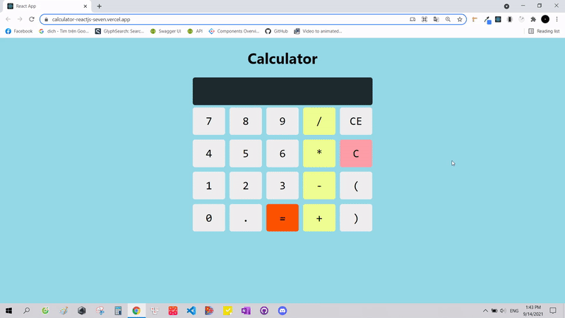

<h1>Calculator</h1>
<h4>Technology: React class component</h4>
<h4>Source: https://github.com/thachsteven/calculator_reactjs</h4>
<h4>Live demo: https://calculator-reactjs-seven.vercel.app/</h4>

<h2>Setting up development environment 🛠</h2>

<ul>
  <li><h4>git clone https://github.com/thachsteven/calculator_reactjs.git</h4></li>
  <li><h4>cd calculator_reactjs</h4></li>
  <li><h4>npm install (or yarn install)</h4></li>
  <li><h4>npm start (or yarn start)</h4></li>
</ul>

